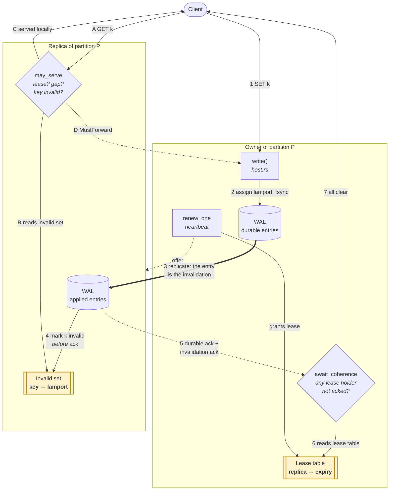
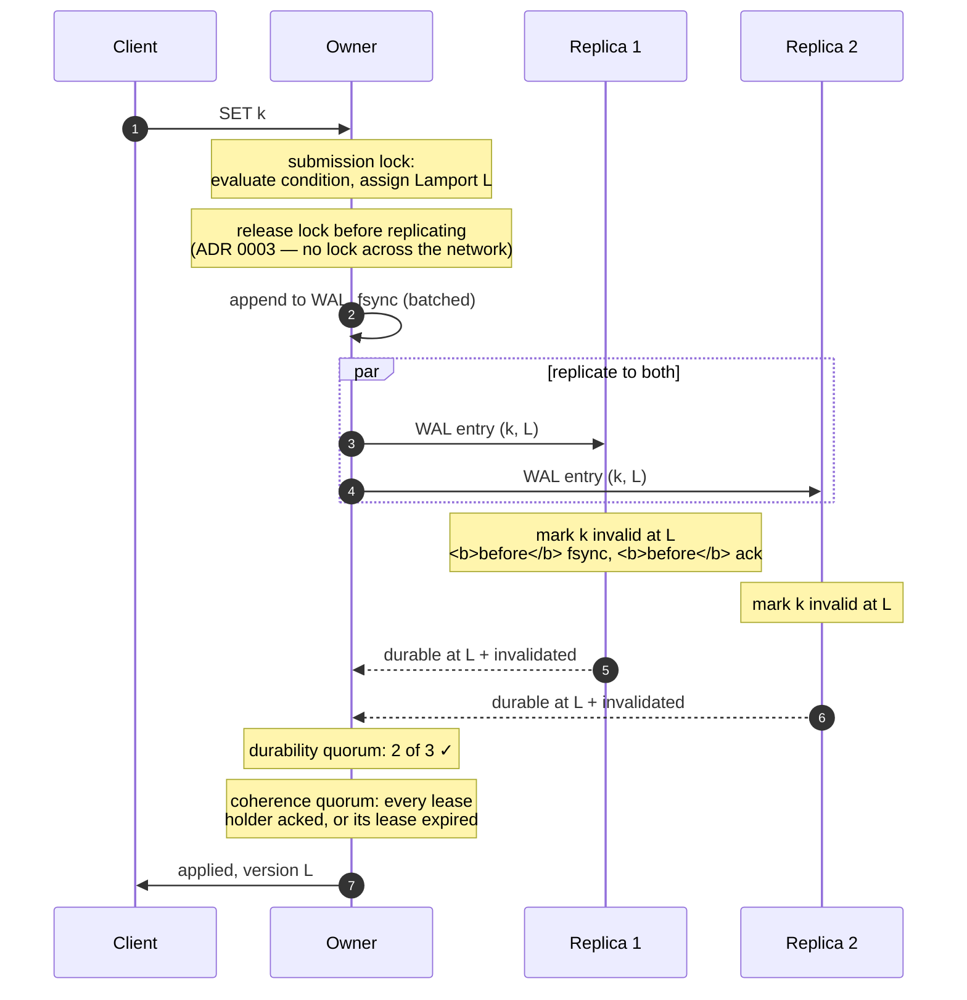
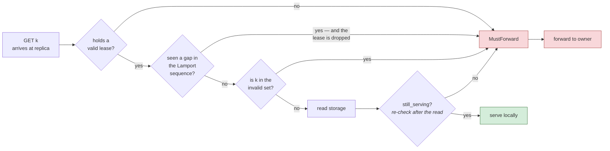

# How the read and write paths interact

The read path and the write path are not independent. They meet in two pieces of
state, and every performance surprise in this system so far has come from that
meeting rather than from either path on its own. This is a map of where they
touch and why.

The decision underneath all of it is
[ADR 0001](adr/0001-linearizable-reads-from-replicas.md). This document does not
restate the reasoning; it shows the mechanism as built, with the code that
implements each step.

## The short version

Replicas serve reads so read capacity grows with the cluster. Every read is
linearizable, so a replica may only answer from state it can prove is current.
It cannot prove that by looking at what it holds, because a replica that has
heard nothing looks exactly like a replica that is up to date. So the owner
tells it, and the telling rides on WAL replication, which is already happening.

That creates the coupling: **a write cannot be acknowledged until no replica can
still answer with the old value.** The write path waits on the read path's
promises.

## The two pieces of shared state

| State | Lives on | Written by | Read by |
| --- | --- | --- | --- |
| **Lease table** | owner | the heartbeat, granting leases (`host.rs::renew_one`) | the write path, deciding who to wait for (`host.rs::await_coherence`) |
| **Invalid set** | replica | arriving WAL entries (`lease.rs::invalidate`) | the read path, deciding serve vs forward (`lease.rs::may_serve`) |

Everything below is those two tables being written on one path and read on the
other.

## The whole picture

The two amber boxes are the coupling. Step 6 is the write path reading state the
heartbeat wrote. Step B is the read path reading state replication wrote.

## The write path, step by step

Two quorums, deliberately different (`host.rs::await_coherence` doc):

- **Durability** asks *will this survive?* Satisfied by two of three.
- **Coherence** asks *can anyone still serve the old value?* Satisfied only by
  every lease holder acknowledging, or its lease expiring.

In the healthy case they are the same messages, so coherence is free. When a
lease holder is slow, the owner waits out its lease — bounded, but on the
client's write.

## The read path, step by step

`host.rs::read` on a replica, in order:

The re-check at `still_serving` is not belt-and-braces. A write for this key can
land *while storage is being read*, and checking once cannot see it — the record
was fetched before the invalidation arrived. The generation counter catches it.
That bug was found by the simulator's linearizability checker rather than by
anyone reasoning it out — the reasoning is on `host.rs::read` itself.

A gap is the other subtle one. Lamports are one monotonic sequence per
partition, so a replica that receives invalidations out of order, or misses one,
sees a hole. A hole cannot be closed by guessing, so the replica drops its lease
and stops serving until it has caught up (`lease.rs::invalidate`). This is why
key versions are partition Lamports
([ADR 0002](adr/0002-key-versions-are-partition-lamports.md)) — a per-key
counter could tell you `abc` moved to v2 but nothing about whether you also
missed an invalidation for `xyz`.

## Where this bites

The coupling means read-path state decides write-path latency. Two known
consequences, both measured:

**A lagging lease holder stalls writes.** `await_coherence` waits for a holder
that has not acked, bounded by that holder's lease — 500ms by default. ADR 0001
allows this once per replica that goes bad, then the replica leaves the read
set. A bug let an evicted replica back in on the next heartbeat, turning "once"
into once per heartbeat: 1,362 stalls in a single benchmark sweep
([#136](https://github.com/orbita-rocks/orbita/issues/136), fixed in
[#138](https://github.com/orbita-rocks/orbita/pull/138)).

**Leases are granted with no read demand.** `renew_one` offers a lease to every
eligible replica on every heartbeat, whether or not any client has ever read
from that replica. Under a write-only workload every write pays coherence for
read capacity nobody is using. Granting on demand would make that case free
without weakening the guarantee, since a replica without a lease simply
forwards.

## What this design refuses, and why

Both alternatives that look obviously cheaper are closed, and it is worth
knowing why before proposing them again.

**"Let the replica check the key's version."** To learn the current version the
replica has to ask the owner, and having paid that round trip it may as well
have forwarded the read.

**"Let the replica forward when it sees a version it does not know."** It never
sees one. It sees silence. Holding `k=v1` with no newer entry is indistinguishable
from holding `k=v1` when the owner has written `v2` that has not arrived. There
is no unrecognised version to trigger a forward — there is an absence, and
absence looks exactly like being current.

A version supplied by the *client* would give read-your-writes, but not
linearizability: a second client reading a key the first just wrote carries no
token and would be served the old value. That is a different guarantee, and
changing to it is a `REQUIREMENTS.md` decision rather than an optimisation.

The lease is what turns "I have heard nothing" into "I have heard nothing **and**
I am promised I would have been told."
