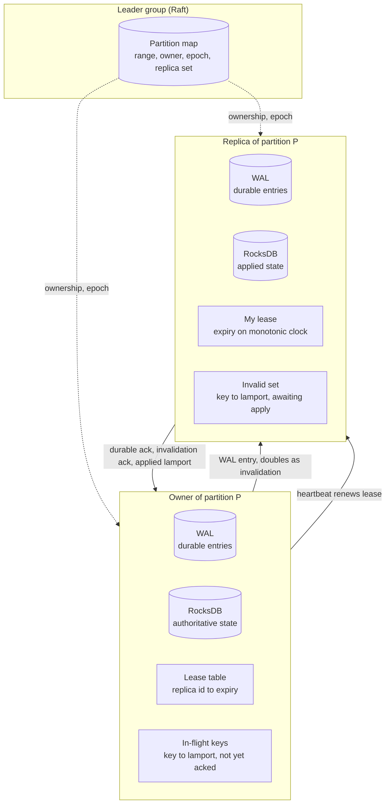
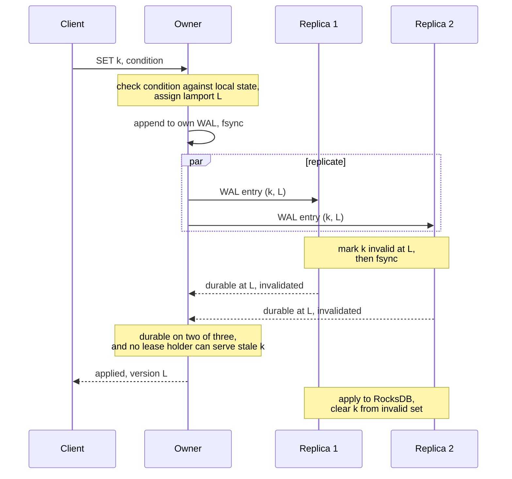
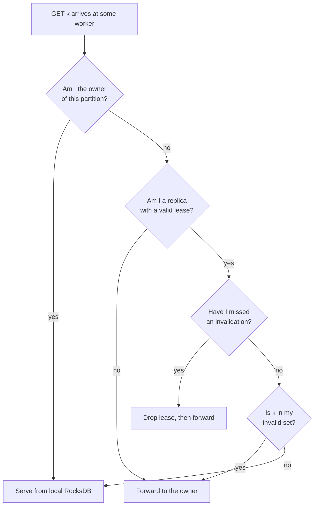

# 0001: Linearizable reads from replicas

Status: Accepted, 2026-08-03.

Supersedes the read path described in the consistency section of
`docs/REQUIREMENTS.md`, which said only that a replica compares a per-partition
Lamport timestamp and forwards to the owner when it is behind. That description
was not wrong so much as incomplete, and completing it turned out to change the
design.

## Context

Orbita optimises reads over writes. Every partition has one owner that
serialises writes and two replicas, and the point of those replicas is that
they serve reads, so that read capacity grows with the cluster instead of
bottlenecking on one node per range. Every read is linearizable, meaning it
must reflect every write that was acknowledged before the read began.

The original sketch was that a replica compares its applied Lamport against the
partition's committed Lamport, serves the read locally when they match, and
forwards to the owner when they do not. Two problems surfaced when we looked at
it closely.

**The first is that it does not scale under write load.** The comparison is
partition-wide, so a single write anywhere in the range makes the replica
behind for every key in the range. Under sustained writes there is essentially
always an entry in flight, so the replica is essentially never exactly caught
up, so nearly every read forwards to the owner. The read fan-out disappears
exactly when the cluster is busy enough to need it, which is the opposite of
the behaviour we are designing for.

**The second is a safety hole.** A replica's knowledge of the committed Lamport
is itself something it learned earlier and may be stale. If the owner commits
at Lamport 100 while the replica has applied 99 and still believes 99 is the
latest, the replica concludes it is caught up and serves a value that predates
an acknowledged write. Believing you are current is not the same as being
current.

We also considered having the replica check the current version of the specific
key being read. That fails for a different reason: to learn the key's current
version, the replica has to ask the owner, and once it has paid that round trip
it may as well have forwarded the read.

The way out is that the replica must not be the one asking. If the owner tells
replicas about writes as it makes them, the replica's read path only consults
state it already has, and no round trip appears on the read.

## Decision

Replicas serve reads under a lease, and the owner invalidates individual keys
by riding on the replication traffic that already exists.

**Leases.** A replica holds a time-bounded read lease over a partition, renewed
by the owner's heartbeat. Only a replica holding a valid lease may serve a read
locally. A replica whose lease lapses stops serving and forwards instead, which
means an owner can take a replica out of the read set by simply not renewing
it.

Leases are compared against monotonic clocks, and the two sides measure from
different instants on purpose. The owner counts a lease as live until
`sent + duration`, and the replica counts its own as expired at
`received + duration - margin`. Because the replica received the lease after
the owner sent it, the replica always gives up first. That ordering is what
makes the scheme safe without synchronised clocks; it needs only that the two
clocks do not run at wildly different rates.

**Per-key invalidation, carried on WAL replication.** The owner already
replicates every write to both replicas. A replica that receives a WAL entry
for key K marks K unreadable locally, before it applies the entry and before it
acknowledges durability. So the message that makes a write durable is also the
message that stops a stale read, and invalidation costs no extra round trip in
the common case.

**Two different quorums.** Durability needs two of three, as before. The read
guarantee needs something else: the owner may acknowledge a write to the client
only once every lease-holding replica has acknowledged the invalidation, or its
lease has expired. In the healthy case those acknowledgements are the same
messages as the durability acknowledgements, so nothing is slower. When a
replica is slow or unreachable, the owner stops renewing that replica's lease
and waits out the remainder, which bounds the delay at one lease duration and
then removes the replica from the read set entirely.

Keeping the two quorums separate is the crux of the design. Durability asks
"will this survive?" and coherence asks "can anyone still serve the old
value?", and conflating them either weakens durability or makes every write
wait for the slowest replica forever.

**Invalidation names a key and a Lamport.** Because a partition's Lamports are
one monotonic sequence, a replica that receives invalidations out of order or
misses one entirely sees a gap. A gap is not recoverable by guessing, so the
replica drops its lease and stops serving until it has caught up. Per-key
counters could not support this: learning that "abc" moved to version 2 tells a
replica nothing about whether it also missed an invalidation for "xyz". This is
the reason for [ADR 0002](0002-key-versions-are-partition-lamports.md).

## What each node holds

The state that is new here is small: a lease table on the owner, and on each
replica its own lease expiry plus the set of keys it has been told about but
has not yet applied. The invalid set is bounded by replication lag rather than
by the size of the keyspace, so it stays small in the healthy case and its
growth is a useful signal when it does not.

## The write path

The acknowledgement to the client waits on two conditions that are usually
satisfied by the same messages: the entry is durable somewhere it will survive,
and no replica that is still allowed to serve reads can hand out the old value.
Applying to RocksDB happens after the client has been told, because the
invalidation, not the apply, is what makes a stale read impossible.

## The read path

Every branch that is not certain forwards. A replica serves locally only when
it holds a live lease, has no gap in its invalidation stream, and has not been
told that this particular key is changing. Being wrong in the conservative
direction costs one intra-cluster hop; being wrong in the other direction
breaks the product's central guarantee.

## Consequences

**Reads scale with replicas under write load,** which was the goal. A read of a
key nobody is writing is served locally no matter how busy the rest of the
partition is.

**Invalidation is free in the common case,** since it rides on replication that
already happens.

**Writes now depend on all lease-holding replicas, not just two of three.** A
degraded replica adds up to one lease duration of write latency once, and is
then dropped from the read set. Lease duration becomes a real tuning knob: too
short and heartbeat traffic climbs and replicas flap out of the read set, too
long and a partition stalls writes for that long. Start near 500ms, measure,
and expose it as configuration.

**There is more state to get right,** and it is the kind that fails silently.
The invalid set, the lease table, and the gap detection all have to be correct
under partitions and failover, so this is a primary target for the simulator's
linearizability checker rather than something to unit test and trust.

**A replica that is partitioned from its owner degrades to forwarding,** which
is correct but means a network fault reduces read capacity rather than read
correctness. That is the right direction for the trade.

**Ownership changes must revoke leases.** A promoted owner cannot serve writes
until the old owner's leases have expired or been explicitly revoked, otherwise
a replica could serve a value from before the failover. This ties the lease
duration to the failover budget in `docs/plan/03-control.md`, and the two must
be designed together rather than separately.

## Alternatives considered

**Partition-level watermark only,** which is what the requirements originally
described. Simplest to build, and rejected because read scaling collapses under
sustained writes and because a replica's view of the watermark is itself stale.

**Replica checks the key's current version with the owner.** Correct, and
pointless: the check costs the round trip that serving locally was meant to
save.

**Invalidate before acknowledging, with no leases.** Safe, and fragile: an
unreachable replica stalls writes indefinitely, so one sick node takes the
partition's write path down. Leases exist precisely to bound that.

**Clients carry read tokens** describing what they have already seen, so a
replica can check freshness without asking anyone. This is a good design and it
is closed to us, because clients are deliberately dumb and we do not want to
maintain a real client library in every language.

**Serve stale reads by default with an opt-in consistent read.** Cheap, and it
gives up the property the product is being sold on.
